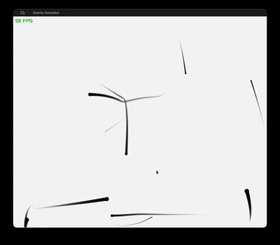

# rayGravity

**Gravity Simulation with Performance Benchmarking**



## Overview

rayGravity simulates particle gravity in 2D, using [raylib](https://www.raylib.com/) for rendering and a custom CPU particle integrator for physics. Project explores performance and optimization techniques for real-time, interactive simulations.

## Features

- 2D gravity simulation with large particle counts (tunable)
- Fast CPU physics engine (`particles_cpu.c`)
- Real-time rendering with [raylib](https://www.raylib.com/) ([C99](https://en.cppreference.com/w/c/language) based)
- User interface via [raygui](https://github.com/raylib-extras/raygui)
- Module abstraction layer (`clay`), easy swap for other backends or platforms
- Minimal dependencies, easy to build

## Directory Structure

```
├── src/
│   ├── main.c              # Entry; GUI, simulation, high-level control, Raylib window
│   └── particles_cpu.c     # Particle simulation, force integration, CPU update
├── include/
│   ├── clay/               # Platform/module abstraction (see clay.h)
│   └── raylib/             # Vendor headers (raylib, raygui, raymath, rlgl)
├── nob.c, nob.h            # Minimal build system utilities
├── README.md
```

## Core Files

- **src/main.c**: App entry point. Sets up Raylib window/context, UI (menus, controls), interactive controls. Calls particle routines. Handles draw loop, user input, frame timing.

- **src/particles_cpu.c**: Physics core. Integrates gravity, updates position/velocity, handles basic collision. Optimized loop for thousands of particles. All CPU-side, no SIMD or GPU.

- **include/clay/clay.h + clay_renderer_raylib.c**: Abstract rendering/platform layer. Allows switching out windowing/render backend. Only raylib is wired up, but extendable.

- **include/raylib/**: All vendor headers for Raylib, Raygui (UI), Raymath (math utils), rlgl (low-level draw). Not modified here.

- **nob.c/h**: Tiny header-only build/make utility. Runs compiler commands. Portable C.

## Running / Building

Dependencies:
- [raylib](https://www.raylib.com/) v4.x (or compatible)

### Quick Build (Unix)
```sh
# Ensure raylib installed (brew, apt, source, etc.)
cc -I./include -lraylib -lm -ldl src/main.c src/particles_cpu.c nob.c -o rayGravity
./rayGravity
```

Or use a provided Make-style build with nob:
```sh
cc nob.c -o nob && ./nob
```

### Windows
Use MSYS2 or Visual Studio, link raylib compatible as above.

## Controls

- **Mouse/drag**: Interact with particles
- **UI**: Adjust simulation params via Raygui menus
- **Esc**: Quit

## Extending
- Add more particle integrators (see `particles_cpu.c`)
- Swap rendering backend by implementing clay interface
- Expand UI for custom scenarios

## Credits
- Uses [raylib](https://www.raylib.com/), [raygui](https://github.com/raysan5/raygui), [raymath](https://github.com/raysan5/raylib/blob/master/src/raymath.h)
- clay abstraction from custom code
- nob from [nob](https://github.com/tsoding/nob)

## License
MIT. See source files for details.
